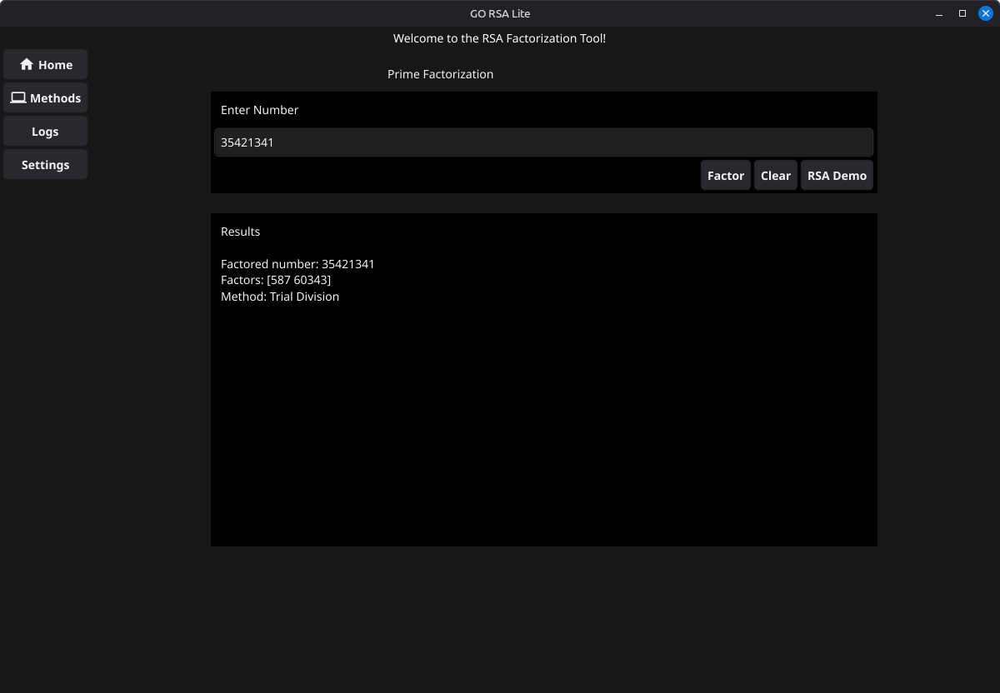
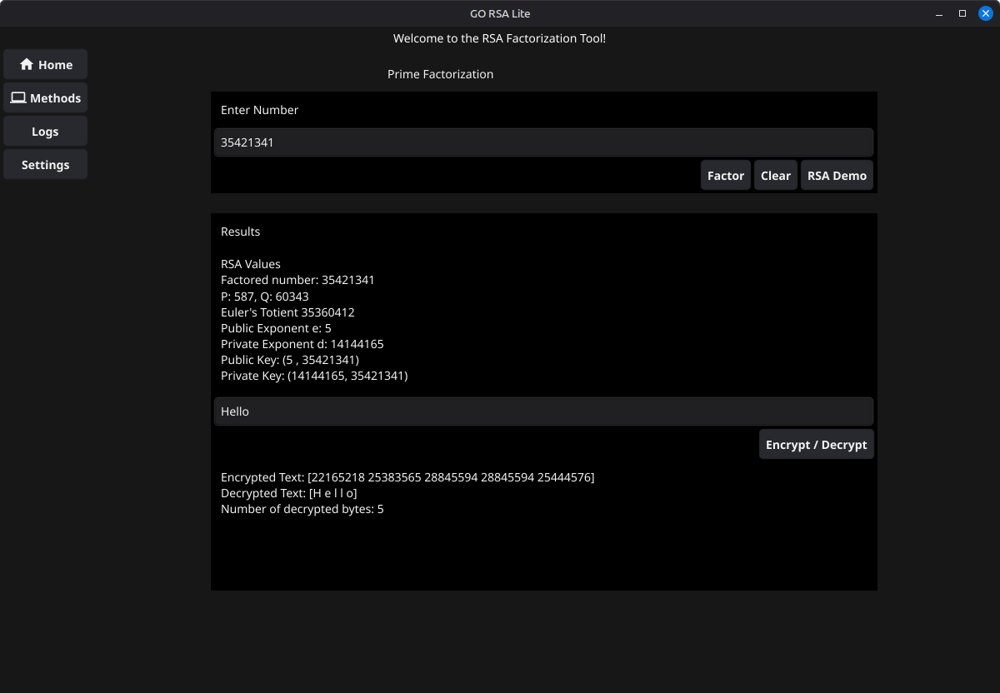
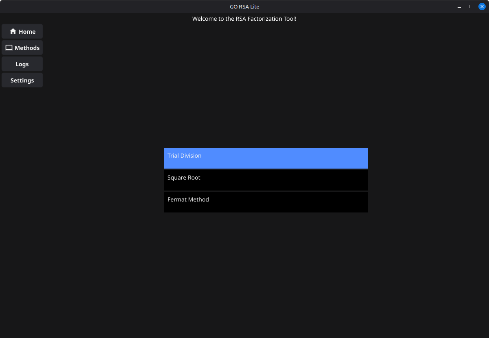
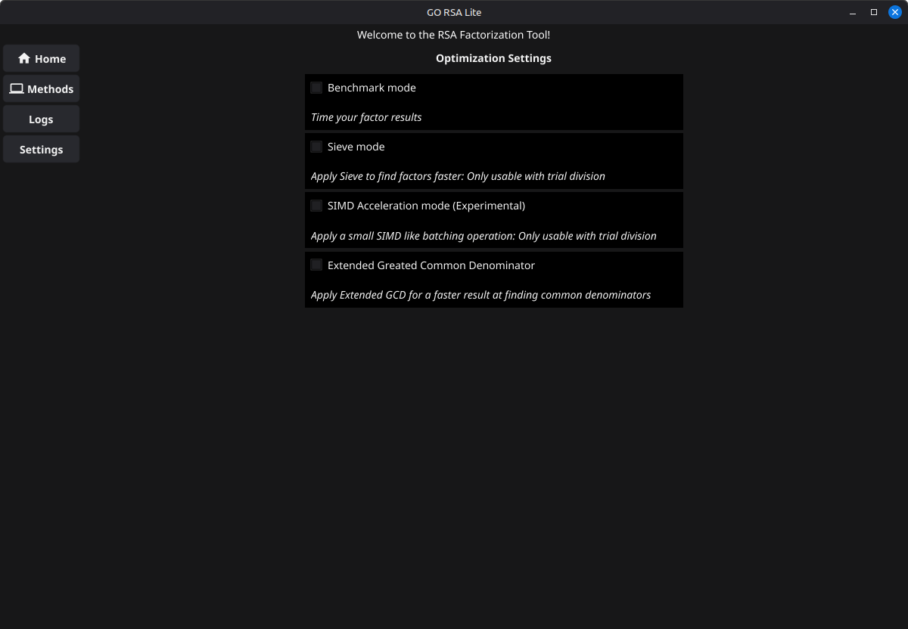
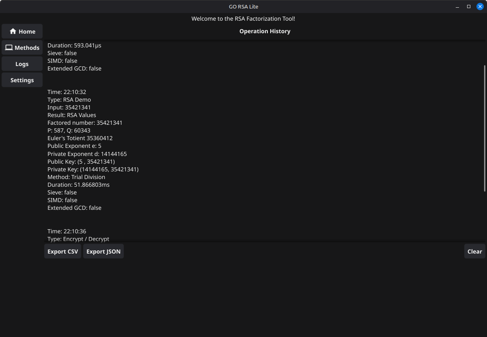

# goRSAlite

goRSAlite is a lightweight RSA and integer factorization tool written in Go. It includes both a command-line interface and a Fyne-based desktop GUI for experimenting with factorization methods, RSA key generation, encryption, and decryption.

This project is intended for learning and demonstration. It is not production cryptography software.

## Features

- Factor integers using several methods
- Generate RSA values from two prime factors
- Calculate Euler's totient
- Choose a public exponent
- Calculate the private exponent with either brute force or Extended GCD
- Encrypt and decrypt short messages one byte at a time
- Use either the CLI or GUI
- Export logs/results from the GUI
- Run unit tests for RSA and factorization logic

## Requirements

- Go 1.24.4 or newer

## Running the CLI

```bash
go run ./cmd/cli
```

The CLI asks for a message, a number to factor, a factorization method, and whether to run the RSA demo.

## Running the GUI

```bash
go run ./cmd/gui
```

The GUI includes screens for factorization, RSA demo output, logs, and settings.

## Screenshots

### Factorization



### RSA Demo



### Methods and Settings





### Logs



## Running Tests

```bash
go test ./...
```

If your Go build cache has permission issues, use a local cache path:

```bash
GOCACHE=/tmp/go-build go test ./...
```

## Example RSA Demo

For:

```text
n = 35421341
p = 587
q = 60343
```

goRSAlite calculates:

```text
totient = 35360412
e = 5
d = 14144165
```

The message `Hello` is encrypted one byte at a time and can be decrypted back into the original text.

## Factorization Methods

goRSAlite includes:

- Trial division
- Trial division with sieve
- SIMD trial division variants
- Square root factorization
- Fermat factorization

## Project Layout

```text
cmd/cli                 CLI entry point
cmd/gui                 GUI entry point
cmd/gui/screens         GUI screens
internal/controller     GUI and workflow controller logic
internal/factorization  Factorization algorithms
internal/rsa            RSA math, encryption, and decryption
```

## Security Notice

This project uses small integers and simplified RSA logic for educational purposes. Real RSA systems require large secure primes, secure randomness, padding, side-channel protections, and well-reviewed cryptographic libraries.

Do not use goRSAlite to protect real secrets.

## Release

The first stable release target is:

```text
v1.0.0
```

Suggested release commands:

```bash
git tag -a v1.0.0 -m "Release v1.0.0"
git push origin v1.0.0
```

## License

No license has been specified yet.
